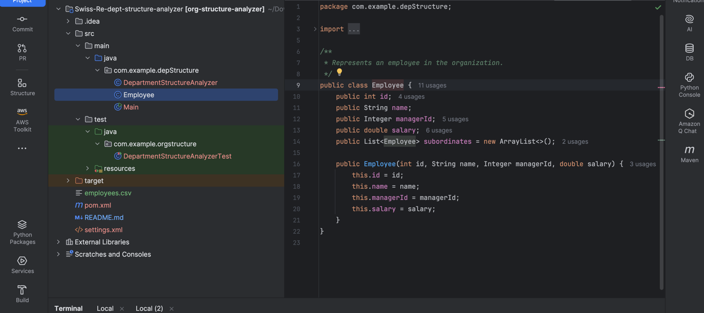
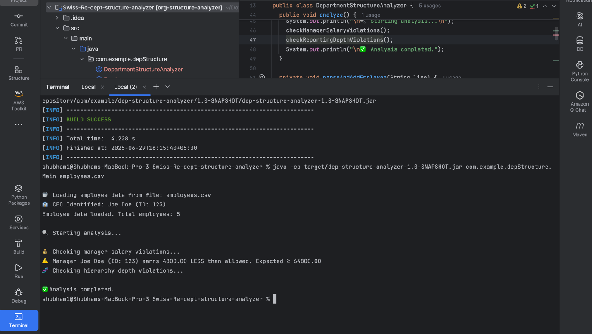

# Swiss-Re-dept-structure-analyzer

A Java SE application to analyze a department’s reporting structure and salary compliance based on employee data from a CSV file.

## 📌 Problem Statement

The application validates two organizational rules:

1. **Manager Salary Rule**  
   Every manager must earn **at least 20% more** and **no more than 50% more** than the **average salary** of their **direct subordinates**.

2. **Reporting Line Depth**  
   Employees must not have **more than 4 managers** between them and the **CEO**.

---

## 📂 Project Structure

```
department-structure-analyzer/
├── pom.xml
├── employees.csv
├── src/
│   ├── main/java/com/example/department/
│   │   ├── Main.java
│   │   ├── Employee.java
│   │   └── DepartmentStructureAnalyzer.java
│   └── test/java/com/example/department/
│       └── DepartmentStructureAnalyzerTest.java
```

---

## 📥 Input

**CSV File Format**:
```
employeeId,employeeName,managerId,salary
1,John,,100000
2,Alice,1,80000
3,Bob,1,70000
4,Charlie,2,50000
5,Eve,2,48000
6,Dave,3,45000
```

- `managerId` is empty for the CEO.
- Salaries are in decimal or integer format.

---

## 🚀 How to Run

### Prerequisites:
- Java 8 or above
- Maven

### Step 1: Build the project

```bash
mvn clean install
```

### Step 2: Run the program

```bash
java -cp target/dep-structure-analyzer-1.0-SNAPSHOT.jar com.example.depStructure.Main employees.csv
```

---

## ✅ Features

- Reads employee data from a CSV file.
- Builds manager-subordinate relationships.
- Validates salary boundaries for managers.
- Identifies employees with long reporting chains.
- Uses `java.util.logging.Logger` for clean output.
- Includes JUnit test case.

---

## 🧪 Run Tests

```bash
mvn test
```

---

## 📜 Sample Console Output

```
WARNING: Manager Alice (ID: 2) earns 5600.00 LESS than allowed. Expected ≥ 85600.00
WARNING: Employee Dave (ID: 6) is too deep in hierarchy (depth = 5)
```

---

## 📄 Assumptions

- One CEO exists (with no managerId).
- Each employee has one and only one direct manager.
- CSV input is well-formatted and valid.

---

## 📁 Sample Test CSV

Test input file is located at:  
`src/test/resources/employees.csv`

---

## ✨ Technologies Used

- Java SE
- Maven
- JUnit

---




